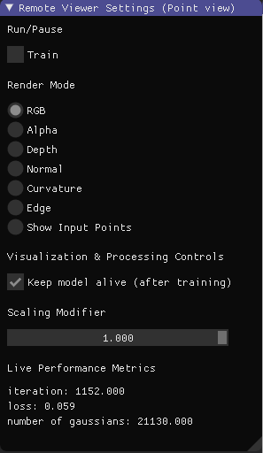

<h1 align="center"> Gaussian Splatting Monitor</h1>
<p align="center">
<a href="https://drive.google.com/file/d/1DRFrtFUfz27QvQKOWbYXbRS2o2eSgaUT/view?usp=sharing">Pre-built Viewer for Windows</a>
</p>
<p align="center">

</p>


This repository builds upon the ["3D Gaussian Splatting for Real-Time Radiance Field Rendering" project](https://repo-sam.inria.fr/fungraph/3d-gaussian-splatting/) by adding new features that enhance its utility for research purposes. Originally, Gaussian splatting excells in producing high-quality renderings but is constrained to only rendering RGB images and backprogating gradients based on RGB loss. This limitation hindered the potential for investigating the volumetric analysis of the Gaussian Splatting (GS) model and the development of novel loss functions. In contrast, models derived from Neural Radiance Fields (NeRF) leverage their fully connected MLP architectures to offer greater versatility in processing various input and output features, as well as in crafting loss functions. 
Inspired by these advancements, this codebase supports additional diffirentiable outputs, aiming to spur innovative research ideas.

## New Features



The latest updates enhance the existing Gaussian Splatting (GS) codebase while maintaining compatibility:

### Expandable Viewer
The viewer is now customizable, allowing for visualization of various render items. Ensure that the rendered image adheres to the formats `(1, h, w)` or `(3, h, w)`, with single-channel images automatically converting to the turbo colormap. To configure the render items, modify the `render_items` list in `arguments/__init__.py`:

```python
self.render_items = ['RGB', 'Alpha', 'Depth', 'Normal', 'Curvature', 'Edge']
```
Then implement the calculation for each item in the ```render_net_image()``` function located in ```utils/image_utils.py```.

### Metrics Viewer
View metrics directly within the viewer, eliminating the need to switch between the viewer and the terminal for RGB effects and loss metrics. Configure the metrics dictionary as follows in ```train.py``` or ```view.py```:

```python
metrics_dict = {
    "iteration": iteration,
    "number of gaussians": gaussians.get_xyz.shape[0],
    "loss": loss,
    # Add more metrics as needed
}
```
### Implementation of Five Additional Features
We have added five new features: 'Alpha', 'Depth', 'Normal', 'Curvature', and 'Edge'. These are designed to demonstrate the capabilities of the GS Monitor and are applicable across all GS models.


## Setup

This codebase builds upon the original GS repository and maintains compatibility with it. Therefore, if you want to set up the repository smoothly or you face some errors, we strongly advise you to explore the [video tutorial](https://www.youtube.com/watch?v=UXtuigy_wYc), review the [issues](https://github.com/graphdeco-inria/gaussian-splatting/issues), and check the [FAQ section](https://github.com/graphdeco-inria/gaussian-splatting?tab=readme-ov-file#faq). This may help you identify if your concern is a known issue and, ideally, lead you to a solution.


### Installation

```shell
git clone https://github.com/RongLiu-Leo/Gaussian-Splatting-Monitor.git
cd Gaussian-Splatting-Monitor
conda env create --file environment.yml
conda activate gs_monitor
```
Please note that this process assumes that you have CUDA SDK **11** installed, not **12**.

## Interactive Viewers
Remote Viewer and Gaussian Viewer are integrated into one Viewer and it is driven by ```train.py``` or ```view.py```.
We provide pre-built binaries for Windows [here](https://drive.google.com/file/d/1DRFrtFUfz27QvQKOWbYXbRS2o2eSgaUT/view?usp=sharing) for an efficient setup.
If your OS is Ubuntu 22.04, you need to compile the viewer locally:
```shell
# Dependencies
sudo apt install -y libglew-dev libassimp-dev libboost-all-dev libgtk-3-dev libopencv-dev libglfw3-dev libavdevice-dev libavcodec-dev libeigen3-dev libxxf86vm-dev libembree-dev
# Project setup
cd SIBR_viewers
cmake -Bbuild . -DCMAKE_BUILD_TYPE=Release # add -G Ninja to build faster
cmake --build build -j24 --target install
```

## How to use
Firstly open the viewer, 
```shell
<path to downloaded/compiled viewer>/bin/SIBR_remoteGaussian_app_rwdi.exe
```
and then
```shell
# Monitor the training process
python train.py -s <path to COLMAP or NeRF Synthetic dataset> 
# View the trained model
python view.py -s <path to COLMAP or NeRF Synthetic dataset> -m <path to trained model> 
```
## Acknowledgments

This repository owes its foundation to the [original GS repository](https://github.com/graphdeco-inria/gaussian-splatting) and incorporates CUDArasterater code from [diff-gaussian-rasterization](https://github.com/slothfulxtx/diff-gaussian-rasterization). We are grateful to the original authors for their open-source codebase contributions.

## Star

If you use this repository for your research, please consider giveing us star.