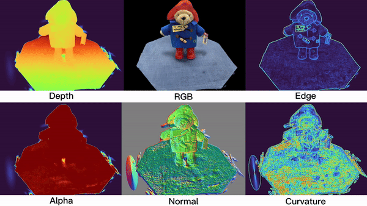

<h1 align="center"> Gaussian Splatting Studio</h1>

<p align="center">

</p>


This repository builds upon the ["3D Gaussian Splatting for Real-Time Radiance Field Rendering" project](https://repo-sam.inria.fr/fungraph/3d-gaussian-splatting/) by adding new features that enhance its utility for research purposes. Originally, Gaussian splatting excells in producing high-quality renderings but is constrained to only rendering RGB images and backprogating gradients based on RGB loss. This limitation hindered the potential for investigating the volumetric analysis of the Gaussian Splatting (GS) model and the development of novel loss functions. In contrast, models derived from Neural Radiance Fields (NeRF) leverage their fully connected MLP architectures to offer greater versatility in processing various input and output features, as well as in crafting loss functions. 
Inspired by these advancements, this codebase supports additional diffirentiable outputs, aiming to spur innovative research ideas.

## New Features

The updated codebase offers several improvements over the original Gaussian Splatting (GS) repository and is compatable with it:

- TODO: Replacement of Colmap with Pycolmap for direct Python-based data conversion, eliminating the need for Colmap installation.
- Expanded support for differentiable rendering attributes, all of which are viewable in real-time SIBR Viewer and can be utilized as loss functions for backpropagation and optimization of the GS model. Supported attributes: RGB, Alpha, Depth, Normal, Edge, Curvature.
- TODO: Introduction of a new Python viewer script that builds on SIBRviewer, integrating Remote Viewer and Gaussian Viewer functionalities.

## Tiny-GS branch
- [x] Make Trainer works
- [x] Test train.py
- [x] Add logger
- [x] Add Gui
- [x] Delete unnessesary functions
- [] Modify Matrices
- [] Modify Render
- [] Test continue training
- [] Test multi-resolution image

## Acknowledgments

This repository owes its foundation to the [original GS repository](https://github.com/graphdeco-inria/gaussian-splatting) and incorporates CUDArasterater code from [diff-gaussian-rasterization](https://github.com/slothfulxtx/diff-gaussian-rasterization). We are grateful to the original authors for their open-source codebase contributions.

## Setup

This codebase builds upon the original GS repository and maintains compatibility with it. Therefore, if you want to set up the repository smoothly or you face some errors, we strongly advise you to explore the [video tutorial](https://www.youtube.com/watch?v=UXtuigy_wYc), review the [issues](https://github.com/graphdeco-inria/gaussian-splatting/issues), and check the [FAQ section](https://github.com/graphdeco-inria/gaussian-splatting?tab=readme-ov-file#faq). This may help you identify if your concern is a known issue and, ideally, lead you to a solution.


### Clone the Repository

```shell
git clone https://github.com/RongLiu-Leo/Gaussian-Splatting-Studio.git
cd Gaussian-Splatting-Studio
```

### Create Conda Environment


```shell
SET DISTUTILS_USE_SDK=1 # Windows only
conda env create --file environment.yml
conda activate gs_studio
```
Please note that this process assumes that you have CUDA SDK **11** installed, not **12**.


### Scripts
We only list the simple usage of scripts below. You can check the [original GS repository](https://github.com/graphdeco-inria/gaussian-splatting) for detailed command line arguments.

#### Train GS Model
```shell
python train.py -s <path to COLMAP or NeRF Synthetic dataset>
```

#### Render and Evaluate

```shell
python train.py -s <path to COLMAP or NeRF Synthetic dataset> --eval # Train with train/test split
python render.py -m <path to trained model> # Generate renderings
python metrics.py -m <path to trained model> # Compute error metrics on renderings
```


#### Real-time Viewer
Firstly open the Real-time viewer, and then do
```shell
python train.py -s <path to COLMAP or NeRF Synthetic dataset> # Monitor the training process
python viewer.py -s <path to COLMAP or NeRF Synthetic dataset> -m <path to trained model> # View the trained model
```
####

## Interactive Viewers
Remote Viewer and Gaussian Viewer are integrated into one Viewer and it is driven by viewer.py.
We provide pre-built binaries for Windows [here]() for an efficient setup. If you want to build and compile the SIBR Viewer, the requirements and instructions can be found [here](https://github.com/graphdeco-inria/gaussian-splatting?tab=readme-ov-file#interactive-viewers).
`

## Processing your own Scenes

GS COLMAP loaders expect the following dataset structure in the source path location:

```
<location>
|---images
|   |---<image 0>
|   |---<image 1>
|   |---...
|---sparse
    |---0
        |---cameras.bin
        |---images.bin
        |---points3D.bin
```

For rasterization, the camera models must be either a SIMPLE_PINHOLE or PINHOLE camera. We provide a converter script ```convert.py```, to extract undistorted images and SfM information from input images. Optionally, you can use ImageMagick to resize the undistorted images. This rescaling is similar to MipNeRF360, i.e., it creates images with 1/2, 1/4 and 1/8 the original resolution in corresponding folders. To use them, please first install a recent version of COLMAP (ideally CUDA-powered) and ImageMagick. Put the images you want to use in a directory ```<location>/input```.
```
<location>
|---input
    |---<image 0>
    |---<image 1>
    |---...
```
 If you have COLMAP and ImageMagick on your system path, you can simply run 
```shell
python convert.py -s <location> [--resize] #If not resizing, ImageMagick is not needed
```


